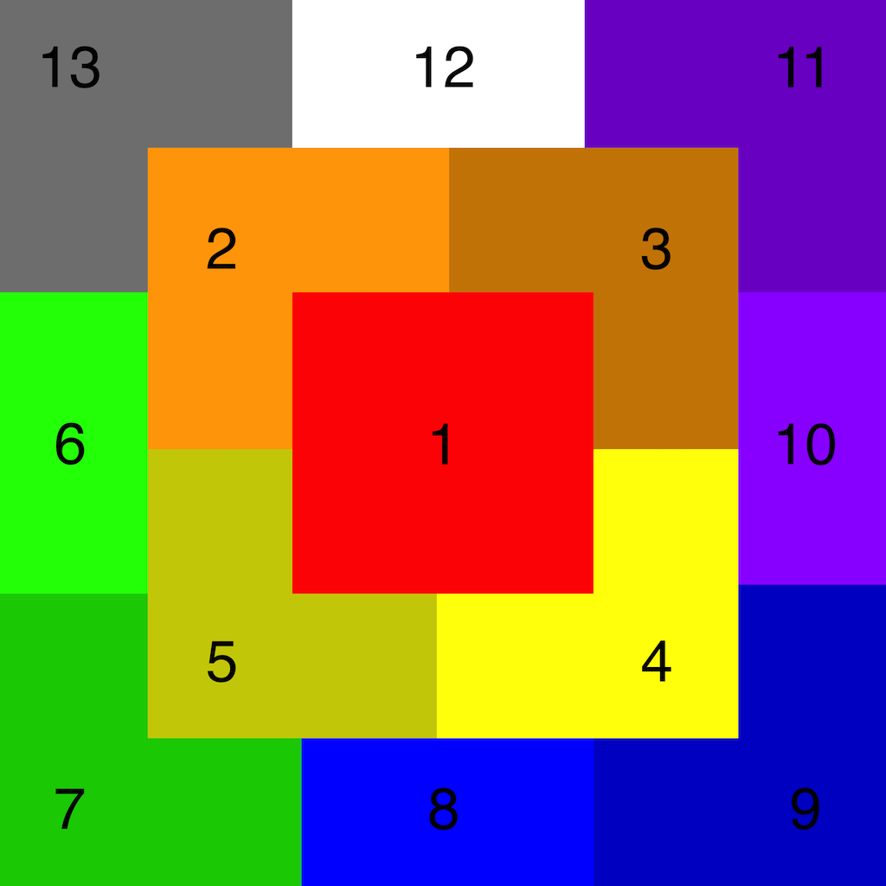

# dalle2_outpaint
Scripts/tools for dalle2 outpainting

## outpaint.sh
### Instructions
This shell script, which uses imagemagick, can be used for 1 (1912x1912) or 2 (2868x2868) layers of square outpainting each step of the process (see illustration below) involves the following steps:
 1. Cropping out the region that needs to be outfilled
 2. (outside script) Upload image to OpenAI for outfill. Choose your favorite result.
 3. (outside script) View source of html to download the webp version of the image without the OpenAI watermark in the corner
 4. Add the new outfilled image to the collage
 5. Repeat until complete

Each step of the script uses filename that correspond to the section in the illustration below. So for example:
 * 2.png is the file you will upload to OpenAI in step 2 above
 * 2.webp is the file you will download from OpenAI in step 3
 * o2.png is the collage with 2.webp added

For now the user has to run these commands manually in an iterative fashion since there are steps that need to be run by the human and there is no api access to allow for automation at this time. In the future this could potentially become a semi-automated webapp.

### Illustration

### Output
There will be 2 main output files of the process:
* stage1.png (this includes the inner square of 1-4)
* final.png (this includes the full outpainting of 1-13)
